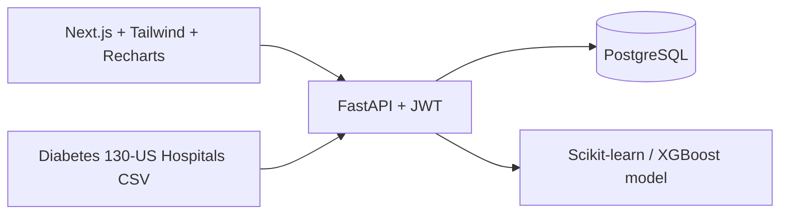

# HealthForecast AI

HealthForecast AI is a local, Docker-based college demonstration for hospital readmission prediction and patient risk intelligence. It uses the supplied Diabetes 130-US Hospitals dataset to provide role-based patient workflows, 30-day readmission prediction, treatment outcome analysis, clinical decision-support prompts, and healthcare analytics.

## Features

- JWT login for Doctor, Hospital Administrator, Healthcare Researcher, and System Administrator roles.
- Patient records with medical, treatment, and admission history; a role-filtered high-risk queue; risk prediction; and care-plan/follow-up status tracking.
- Binary prediction of readmission within 30 days using the supplied dataset.
- Model evaluation with accuracy, precision, recall, F1-score, and ROC-AUC.
- Treatment, insulin, HbA1c, and medication-outcome patterns; clinical decision-support prompts; population-health, specialty/department-proxy, and utilization analytics.
- Hospital operations CSV and anonymized researcher CSV exports.
- System Administrator user, doctor-patient assignment, model activation, and local retraining controls.
- One-command local Docker Compose deployment. No AWS or Azure service is used.

## Architecture



## Prerequisites

- Docker Desktop, with Docker Compose enabled.
- The supplied `diabetic_data.csv` in `data/`. It has already been placed there in this workspace.

If the CSV is missing, extract it from the supplied archive:

```bash
unzip -j "/Users/lavanay/Downloads/archive.zip" diabetic_data.csv -d data
```

## Run locally

```bash
docker compose up --build
```

The first start creates the database, imports the CSV, seeds the demo accounts, and starts:

- Frontend: `http://localhost:3001`
- Backend API docs: `http://localhost:8000/docs`

Stop the application with `docker compose down`. To reset imported data, run `docker compose down -v` and then start it again.

## Demo accounts

All accounts use the password `Demo123!`.

| Role | Email |
| --- | --- |
| Doctor | `doctor@healthforecast.local` |
| Hospital Administrator | `admin@healthforecast.local` |
| Healthcare Researcher | `researcher@healthforecast.local` |
| System Administrator | `system@healthforecast.local` |

## Train the model

A trained model artifact is available in this workspace. To retrain from the supplied data after the stack starts:

```bash
docker compose exec backend python -m app.train_model
```

The training script compares Logistic Regression, Random Forest, and XGBoost when the runtime supports it, selects the model with the highest test ROC-AUC, saves the model artifact, and records its metrics.

## Role access

- **Doctor:** assigned patient records, risk prediction, high-risk queue, and care-plan/follow-up tracking.
- **Hospital Administrator:** hospital-wide dashboard, specialty/department-proxy analytics, and operations report; no patient edits.
- **Healthcare Researcher:** aggregate population/performance analytics and anonymized CSV export.
- **System Administrator:** user, doctor-patient assignment, model activation/retraining, and full dashboards.

## Important data limitations

The supplied dataset is de-identified and contains no encounter dates or hospital identifier. Hospital and trend analytics therefore use available encounter, admission, treatment, and outcome fields. Treatment views report observed dataset patterns only; they do not establish medical causation. The project is an educational demonstration and is not a clinical decision-making system.

## Verification

The backend includes a role and workflow smoke test. With Python dependencies installed:

```bash
PYTHONPATH=backend pytest backend/tests
```

See [the mentor demo script](docs/mentor-demo.md) for the recommended presentation flow.
