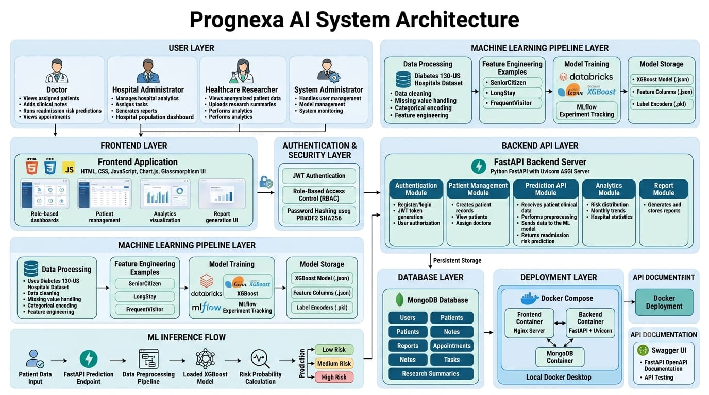
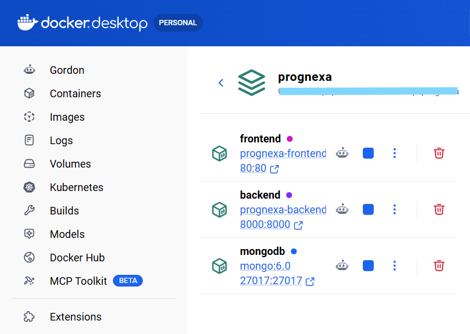
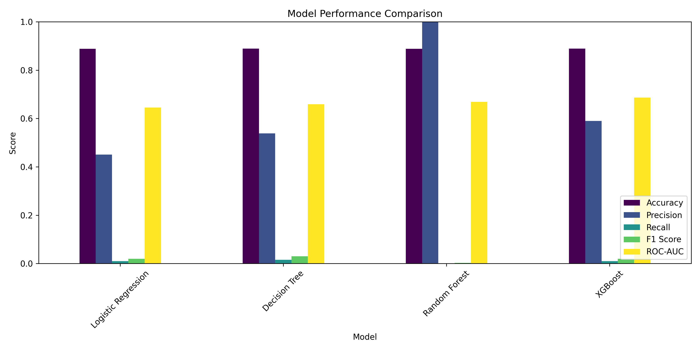

# 🏥 Prognexa AI – Hospital Readmission Prediction & Patient Risk Intelligence System


**Prognexa AI** is an end‑to‑end healthcare analytics platform that uses machine learning (XGBoost) to predict hospital readmission risk. It provides role‑based dashboards for **Doctors**, **Hospital Administrators**, **Healthcare Researchers**, and **System Administrators** – with features for patient management, risk prediction, analytics, and report generation.

---

## 🔗 Quick Links

- 🎥 **Demo Video:** https://drive.google.com/file/d/1X2wa2hXByU6Q67fbrbJE0rDJfu1-FI2_/view?usp=drivesdk

---

## ✨ Features

- 🔐 **Role‑Based Access Control** – Doctor, Admin, Researcher, SysAdmin with specific permissions
- 🧠 AI-Powered Prediction – XGBoost model for hospital readmission risk prediction
- 📋 **Patient Management** – Create, view, assign, and delete patient records
- 📊 **Real‑Time Analytics** – Risk distribution charts, monthly trends, and summary stats
- 📑 **Report Generation** – Generate and view reports with patient risk levels
- 📝 **Notes & Appointments** – Doctors can add clinical notes and manage appointments
- 📅 **Task Management** – Admins can assign tasks to doctors; doctors can view assigned tasks
- 📄 **Research Summaries** – Researchers can post and view research findings
- 🏥 **Hospital Population Dashboard** – View occupancy and high‑risk patient priority lists
- 🔧 **Settings** – Change password securely
- 🗄️ **MongoDB Storage** – Persistent storage for users, patients, reports, notes, appointments, tasks, and research data.
- 📊 **Chart.js Visualizations** – Interactive charts for risk distribution and trends
- 🐳 **Dockerized** – Containerized deployment using Docker and Docker Compose.

---

## 🛠️ Tech Stack

| Layer | Technology |
|-------|------------|
| **Backend** | FastAPI (Python) |
| **Database** | MongoDB |
| **Frontend** | HTML, CSS, JavaScript (Chart.js) |
| **ML Pipeline** | Databricks, PySpark, MLflow |
| **ML Model** | XGBoost, scikit-learn, pandas, numpy |
| **Auth** | JWT (python‑jose) + passlib (pbkdf2_sha256) |
| **Server** | Uvicorn (ASGI) |
| **Containerization** | Docker, Docker Compose |
| **Styling** | Glassmorphism UI with Inter font |

---


## 🏗️ System Architecture

Prognexa AI follows a modular architecture combining frontend visualization, secure backend APIs, machine learning inference, and persistent database storage.



---

## 📁 Project Structure

```
Prognexa-AI/
├── backend/
│   ├── Dockerfile
│   ├── app.py                 # FastAPI main application
│   ├── config.py              # Configuration (MongoDB, JWT)
│   ├── loader.py              # Model loading utilities
│   ├── predict.py             # Prediction logic
│   ├── preprocessor.py        # Data preprocessing
│   ├── schemas.py             # Pydantic models
│   ├── seed.py                # Predefined dataset
│   └── requirements.txt       # Python dependencies     
├── model/ 
│       ├── readmission_model.json
│       ├── feature_columns.json
│       └── label_encoders.pkl
├── frontend/
│   ├── Dockerfile
│   ├── index.html             # Complete single‑page application
│   ├── nginx.conf             # Nginx configuration
│   ├── docker-entrypoint.sh   # Entrypoint script
│   └── pic.jpg                # Background image
├── assets/
│   ├── architecture.png
│   ├── docker-deployment.png
│   └── confusion_matrix.png
├── docker-compose.yml
└── README.md
```

---

## 🐳 Docker Deployment

### Prerequisites
- Docker Desktop (with WSL 2 on Windows)
- Docker Compose

### Services
| Service | URL |
|---------|-----|
| Frontend | http://localhost:80 |
| Backend API | http://localhost:8000 |
| Swagger UI | http://localhost:8000/docs |
| MongoDB | Internal Docker Network (mongodb://mongo:27017) |

### Commands
```bash
docker-compose up --build -d  # Start in background
docker-compose logs -f        # View logs
docker-compose down           # Stop containers
docker-compose down -v        # Remove volumes (clean database)
```

### Environment Variables
Create a `.env` file:
```env
MONGO_USERNAME=admin
MONGO_PASSWORD=password
DB_NAME=prognexa
JWT_SECRET_KEY=your-secret-key-change-in-production
API_URL=http://localhost:8000
```
> ⚠️ Never commit the `.env` file to GitHub. Add it to `.gitignore`.

---

## 🚀 Manual Setup (Without Docker)

### 1. Clone Repository
```bash
git clone https://github.com/<your-github-username>/<your-repository-name>.git
cd <your-repository-name>
```

### 2. Create Virtual Environment
```bash
# Windows
python -m venv venv
venv\Scripts\activate

# macOS / Linux
python3 -m venv venv
source venv/bin/activate
```

### 3. Install Dependencies
```bash
cd backend
pip install -r requirements.txt
```

### 4. Start MongoDB
```bash
# Windows (Admin)
net start MongoDB

# macOS (Homebrew)
brew services start mongodb-community

# Linux
sudo systemctl start mongod
```

### 5. Seed Database (Optional)
```bash
python seed.py
```

### 6. Run Backend Server
```bash
uvicorn app:app --reload --host 0.0.0.0 --port 8000
```

### 7. Open Frontend
- Option A: Open `frontend/index.html` directly in browser
- Option B: Serve with Python HTTP server:
  ```bash
  cd frontend
  python -m http.server 5500
  # Open http://localhost:5500
  ```

---

## 👥 User Roles & Permissions

| Feature | Doctor | Admin | Researcher | SysAdmin |
|---------|--------|-------|------------|----------|
| **Predict Readmission** | ✅ Yes | ❌ No | ❌ No | ✅ Yes |
| **Generate Reports** | ❌ No | ✅ Yes | ✅ Yes | ✅ Yes |
| **View Patients** | ✅ Own | ✅ All | ✅ Anonymized | ✅ All |
| **Add Notes** | ✅ Yes | ❌ No | ❌ No | ❌ No |
| **View Appointments** | ✅ Yes | ❌ No | ❌ No | ❌ No |
| **Assign Tasks** | ❌ No | ✅ Yes | ❌ No | ❌ No |
| **View Tasks** | ✅ Yes | ❌ No | ❌ No | ❌ No |
| **Research Summaries** | ❌ No | ✅ View | ✅ Post & View | ✅ View |
| **User Management** | ❌ No | ❌ No | ❌ No | ✅ Yes |
| **Model Management** | ❌ No | ❌ No | ❌ No | ✅ Yes |
| **Hospital Population** | ❌ No | ✅ Yes | ❌ No | ✅ Yes |

---

## 📚 API Documentation

Once the backend is running, visit `http://localhost:8000/docs` for Swagger UI.

### Key Endpoints

| Method | Endpoint | Description |
|--------|----------|-------------|
| POST | `/register` | Register a new user |
| POST | `/login` | Login and get JWT token |
| GET | `/me` | Get current user info |
| GET | `/patients` | Get patients (role‑based) |
| POST | `/predict` | Run prediction on patient data |
| GET | `/analytics/overview` | Get dashboard statistics |
| POST | `/reports/generate` | Generate a new report |
| GET | `/reports` | Get all reports |
| POST | `/notes` | Add a note (doctor only) |
| GET | `/notes` | Get notes for current user |
| POST | `/admin/schedule` | Create a task (admin only) |
| GET | `/admin/schedules` | Get all schedules |
| POST | `/research/summary` | Post research summary (researcher only) |
| GET | `/research/summaries` | Get all research summaries |
| GET | `/model/status` | Get model status (sysadmin only) |

---

## 🤖 Machine Learning Model Performance

### Dataset
- Diabetes 130-US Hospitals Dataset

### Model
- Algorithm: XGBoost Classifier
- Frameworks:
  - Scikit-learn
  - PySpark
  - MLflow

### Feature Engineering
- SeniorCitizen indicator
- LongStay indicator
- FrequentVisitor indicator
- Categorical feature encoding

### Evaluation Metrics

| Metric | Score |
|--------|-------|
| Accuracy | ~65% |
| Precision | ~65% |
| Recall | ~52% |
| F1 Score | ~58% |
| ROC-AUC | ~71% |

The trained model is stored as an optimized XGBoost JSON model and loaded during API inference.

---

## 🔮 Future Enhancements

- SHAP-based explainable AI for patient risk factors
- Cloud deployment using AWS/Azure
- Automated ML model retraining pipeline
- Doctor recommendation system
- Real-time hospital data integration

---

## 📸 Assets

### 🐳 Docker Deployment



### 📊 Model Performance



---

## 📄 License

MIT License – see [LICENSE](LICENSE) file for details.

